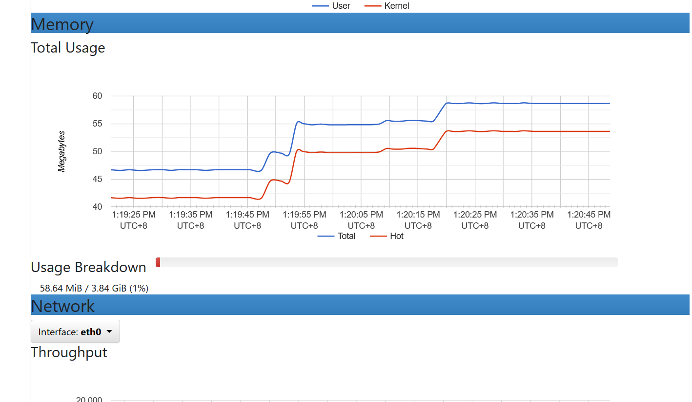

  

----
# Intro

cAdvisor 是 Google 開源的一款用於展示和分析容器運行狀態的可視化工具。
通過在主機上運行 cAdvisor 用戶可以輕松的獲取到當前主機上容器的運行統計信息，並以圖表的形式向用戶展示。
此開源工具可用於監控Container效能，以利於效能優化以及維護。

# 使用方法：
### 安裝
```
sudo docker run \
  --volume=/:/rootfs:ro \
  --volume=/var/run:/var/run:ro \
  --volume=/sys:/sys:ro \
  --volume=/var/lib/docker/:/var/lib/docker:ro \
  --volume=/dev/disk/:/dev/disk:ro \
  --publish=8080:8080 \ # 設定port號
  --detach=true \
  --name=cadvisor \ # 設定container name
  --privileged \
  --device=/dev/kmsg \
  gcr.io/cadvisor/cadvisor:latest
```
### 完成:
- 根據上述設置後，可在 localhost:8080 看見此監控頁面  




----
# 參考文件
- https://github.com/google/cadvisor
- https://sectools.tw/docker-monitor/
